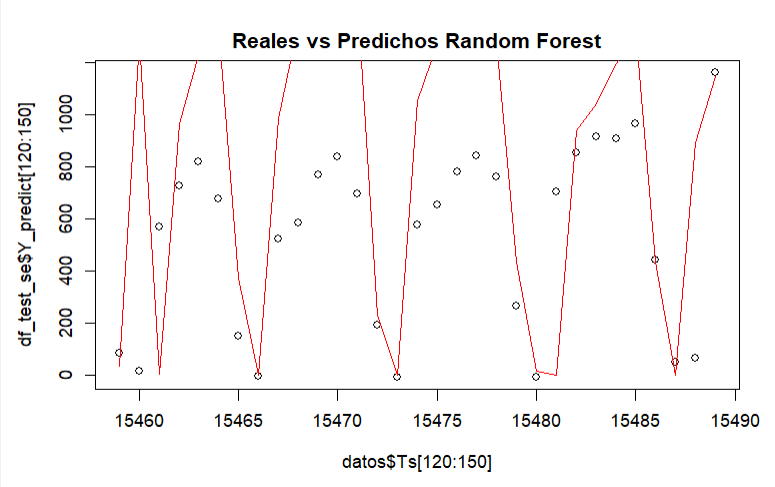

```{r setup, include=FALSE}
knitr::opts_chunk$set(echo = TRUE)
library("readxl")
library("dplyr")
library("stats")
library("simts")
library("tseries")
library("corrplot")
library("forecast")
library("Metrics")
library("yardstick")
library("graphics")
library("randomForest")
library("ggplot2")
library("magrittr")
```
# Lectura de los datos

Los datos corresponden a la suma de los 365 días que tienen los años 2013, 2014, 2015 y 2017 sumados a los 366 días que tiene los años 2012 y 2016. En total, se tienen 2192 datos. El conjunto de datos tiene la fecha y la cantidad de vehículos registrados en esa fecha. 

```{r include=FALSE}
datos <- read_excel("registros_entrenamiento_festivos.xlsx")
```

# Propósito del proyecto

El objetivo del proyecto es aplicar múltiples modelos predictivos sobre este conjunto de datos, obtener las métricas para cada uno de ellos y con base a estas tomar una decisión sobre el que mejor de desempeñe. Para este se toman los años del 2012-2016 como conjunto de entrenamiento, y el año 2017 como conjunto de validación. Finalmente, los resultados serán evaluados con base al R^2 que arroje el modelo para el primer semestre del 2017 y para el primer semestre del 2018.

# Procesamiento de los datos

Los datos originales contienen, únicamente, una variable: La fecha de registro. Para buscar un óptimo análisis, se decide generar 4 variables nuevas con base a la fecha de registro, estas son: día de la semana, número de día del mes, mes y año.
Además, se generó una variable binaria llamada "festivo" para conocer si un día del año es una festividad en Colombia, pues estos días suelen presentar valores atípicos en las unidades registradas y esta variable aporta esta información. Se dividieron en dos conjuntos de datos para no interferir en el modelo de Series de Tiempo, y se calcula una marca de tiempo (ts) para facilitar las gráficas.

```{r, echo=FALSE}
datos_ts <- datos
datos_ts$Fecha <- as.Date(datos$Fecha)
datos_ts$Ts <- as.numeric(datos$Fecha)
datos_ts$Dia_semana <- weekdays(datos$Fecha)
datos_ts$Dia <- format(datos$Fecha, "%d")
datos_ts$Mes <- as.factor(as.numeric(format(datos$Fecha, "%m")))
datos_ts$Anio <- format(datos$Fecha, "%y")
datos_ts$Wday <- lubridate::wday(datos$Fecha, week_start = 1)
datos$Dia_semana <- weekdays(datos$Fecha)
datos$Dia <- format(datos$Fecha, "%d")
datos$Mes <- as.factor(as.numeric(format(datos$Fecha, "%m")))
datos$Anio <- format(datos$Fecha, "%y")
datos$Ts <- as.numeric(datos_ts$Fecha)
datos_ts <- subset(datos_ts, select = c(-Fecha, -Dia_semana))
datos <- datos[, -1]
datos_ts <- datos_ts[, -1]
```

Para un conjunto de datos se dividió la variable categórica "Dia_semana" en 7 variables binarias (dummies), con el fin de trabajar todo el conjunto con numérico.

```{r, echo=FALSE}
# Se dive la variable día de la semana en n variables binarias
dummy <- as.data.frame(model.matrix(~ datos$Dia_semana - 1))
colnames(dummy) <- c("domingo", "lunes", "martes", "miercoles", "jueves", "viernes", "sabado")
datos <- subset(datos, select = c(-Dia_semana, -Fecha))

# Se convertien a numéricos todas las variables excepto el día de la semana
datos[,c(1:5)] <- sapply(datos[,c(1:5)], as.numeric)

# Se unen los dos dataframes
datos <- cbind(datos, dummy)
```

# Análisis estadístico
Se presenta un análisis general del conjunto de datos. Esta es una distribución de los registros a través del tiempo:

```{r,echo=FALSE,fig.cap="Figura 1: Vehiculos registrados diariamente del año 2012 a 2017",fig.align='center'}
plot(datos_ts$Ts, datos_ts$Unidades, xlab="Tiempo",ylab="Vehiculos Registrados", main="Registros diarios de Vehiculos a través del tiempo")
```
También se analizaron los día festivos y domingos con un BoxPlot: 
Box-plot de festivos (primero) y de domingos(segundo) muestra que en estos días el valor de unidades es aproximadamente cero;
```{r, echo=FALSE,fig.cap="Figura 2: BoxPlot vehiculos registrados en dias Festivo",fig.align='center'}


festivos <- datos %>% filter(Festivo==1)
ggplot(festivos, aes(Unidades))+
  geom_boxplot(col="blue", fill="deepskyblue",alpha=0.5)+
  ggtitle("BoxPlot de Vehiculos Registrados Festivos")+
  xlab("Vehiculos Registrados")+
  theme(plot.title = element_text(hjust = 0.5))


```
```{r, echo=FALSE,fig.cap="Figura 3: BoxPlot vehiculos registrados en dias Domingo",fig.align='center'}
domingos <- datos %>% filter(domingo==1)
ggplot(domingos, aes(Unidades))+
  geom_boxplot(col="blue", fill="deepskyblue",alpha=0.5)+
  ggtitle("BoxPlot de Vehiculos Registrados Domingos")+
  xlab("Vehiculos Registrados")+
  theme(plot.title = element_text(hjust = 0.5))

```


Se puede observar que en estos días los registros de vehículos son aproximadamente 0.  

```{r,echo=FALSE,fig.cap="Figura 4: Vehiculos registrados diariamente durante el año 2012",fig.align='center'}
d<-datos_ts[1:366,]
plot(d$Ts, d$Unidades, type = "l", xlab="Dias", ylab="Vehiculos Registrados", main = "Comportamiento de los vehiculos registrados en 2012", 
     col = "red")
```

Se observa una grafica de los vehiculos registrados respecto al tiempo durnte el año 2012, se observa que presenta una varianza estacional con periodo semanal debido a la disminucion de vehiculos registrados en los dias sabado y los nulos vehiculos registrados los domingos. 


```{r,echo=FALSE,fig.cap="Figura 5: BoxPlot de vehiculos registrados desde 2012 hasta 2017",fig.align='center'}
ggplot(datos_ts, aes(Unidades))+
  geom_boxplot(col="blue", fill="deepskyblue",alpha=0.5)+
  ggtitle("BoxPlot de Vehiculos Registrados")+
  xlab("Vehiculos Registrados")+
  theme(plot.title = element_text(hjust = 0.5))

```

En el anterior grafico BoxPlot se observa el comportamiento de la variable Vehiculos Registrados, la posicion de sus cuartiles permite concluir que el 75% de las observaciones estan por debajo de aproximadamente los 1200 vehiculos registrados y asu vez, el 25% estan por debajo de aproxidamadamente los 300 vehiculos registrados.

```{r,echo=FALSE,fig.cap="Figura 6: Grafico de barras del promedio de vehiculos registrados diariamente",fig.align='center'}

unidadesxanio <- datos_ts %>% group_by(Anio) %>% 
  summarise(und_tot=sum(Unidades))

ggplot(unidadesxanio, aes(x=Anio, y=und_tot))+
  geom_col(col="blue", fill="blue",alpha=0.5)+
  ggtitle("Vehiculos Diarios Totales por Año ")+
  xlab("Año")+
  ylab("Vehiculos Totales")+
  geom_text(aes(label=round(und_tot,2)), position = "stack", hjust = 0.5,vjust=-0.2, size=3)+
  theme(plot.title = element_text(hjust = 0.5))

```

En el anterior grafico de barras se tienen el total los vehiculos registrados diariamente por año, desde el año 2012 al año 2017. Se obsera que el año con mas vehiculos registrados fue el 2014, ademas de una tendencia negativa a partir de este año hasta el 2017.


```{r,echo=FALSE,fig.cap="Figura 7: BoxPlot de Vehiculos Registrados por Mes ",fig.align='center'}

ggplot(datos_ts, aes(x=Mes, y=Unidades))+
  geom_boxplot(col="blue", fill="deepskyblue",alpha=0.5)+
  ggtitle("Comportamiento Vehiculos por Mes ")+
  xlab("Mes")+
  ylab("Vehiculos Registrados")+
  theme(plot.title = element_text(hjust = 0.5))

```

En el anterior grafico BoxPlot se observa el comportamiento de los vehiculos diarios registrados discriminados por el mes. Es notable que las cajas se comportan de forma similar a excepcion del mes de diciembre, donde se observa un rango intercuartil mucho mayor al resto de meses. Tambien permite observar algunos registros atipicos en los meses de junio, octubre, noviembre y diciembre. 

```{r,echo=FALSE,fig.cap="Figura 8: Grafico de barras de los vehiculos registrados promedio por dia de la semana",fig.align='center'}

datos_ts$diasem<-datos_ts$Wday
datos_ts$diasem<-as.factor(datos_ts$diasem)
levels(datos_ts$diasem) <- c("Lunes","Martes","Miercoles","Jueves","viernes","Sabado","Domingo") 

unidadesxdia <- datos_ts %>% group_by(diasem) %>% 
  summarise(und_promedio=mean(Unidades))

ggplot(unidadesxdia, aes(x=diasem, y=und_promedio))+
  geom_col(col="black",fill="orange",alpha=0.8)+
  coord_flip()+
  ggtitle("Promedio Vehiculos Registrados por Dia de la Semana")+
  xlab("Dias de la Semana")+
  ylab("Promedio Vehiculos Registrados")+
  geom_text(aes(label=round(und_promedio,1)), position = "stack", hjust = 0, size=3)+
  theme(plot.title = element_text(hjust = 0.5))

```

En el anterior grafico se observan los vehiculos registrados promedio por dia de la semana. Es notable que en los extremos de la semana la media de vehiculos registrados es considerablemente menor a los dias intermedios, alcanzando un pico en el dia viernes. Nuevamente se observa que los dias domingo los registros son 0 o un numero muy bajo y por ende el promedio en este dia es insignificante.


```{r,echo=FALSE,fig.cap="Figura 9: Grafico de barras de la distribucion de tipo de dia ",fig.align='center'}

datos_ts$fest<-datos_ts$Festivo
datos_ts$fest[datos_ts$fest==0] <- "No"
datos_ts$fest[datos_ts$fest==1] <- "Si"

resum <- datos_ts %>% count(fest, sort=TRUE)
resum %<>% mutate( porcentaje = 100*round(n/sum(n),3) )

ggplot(resum, aes(x=fest, y=porcentaje))+
  geom_col(col="purple", fill="purple",alpha=0.5)+
  ggtitle("Tipo de Dia")+
  xlab("Festivo")+
  ylab("Dias Registrados")+
  geom_text(aes(label=round(porcentaje,2)), position = "stack", hjust = 0.5,vjust=-0.2, size=3)+
  theme(plot.title = element_text(hjust = 0.5))


```

Se observa la distribución en porcentaje de los dias comunes y los dias festivos registrados desde el año 2014 hasta el 2017. Los dias festivos representan aproximadamente el 5% de los registros.      


# Separación de datos en entrenamiento y validación

De los 2192 se plantea usar apróximadamente el 75% de los datos para entrenamiento. Teniendo esto en cuenta, se tiene 1644 días, lo cuál equivale a apróximadamente 4.5 años; con el fin de lograr un adecuado entrenamiento para todos los días de cada año, se extenderá este conjunto de entrenamiento hasta los 5 años, es decir, los días entre 01-01-2012 hasta 31-12-2016 y utilizar los días correspondientes al año 2017 como validación.

```{r, echo=FALSE}
df_train_ts <- datos_ts[datos_ts$Anio != "17", ]
df_train_ts <- df_train_ts[df_train_ts$Festivo ==0, ]
df_train_ts <- df_train_ts[df_train_ts$Wday !=7, ]

df_val <- datos_ts[datos_ts$Anio == "17", ]

df_train <- datos[datos$Anio != "17", ]
#df_train_lm <- df_train[df_train$Festivo ==0, ]
#df_train_lm <- df_train_lm[df_train_lm$domingo ==0, ]
df_test <- datos[datos$Anio == "17", ]
```


Con el fin de ver las relaciones de las variables predictoras, se realiza un diagrama de correlación: 
```{r, echo=FALSE,fig.cap="Figura 10: Grafico de Correlaciones variables predictoras",fig.align='center'}
corr_train = cor(df_train)
corrplot(corr_train)
```
Del cual se puede observar que no existen correlaciones fuertes entre las variables predictoras (todas, excepto Ts). Además, se percibe relaciones entre las predictoras y la objetivo.

# Modelo de regresión lineal

Se inicia con un modelo lineal ya que se tienen relaciones lineales entre las variables predictoras y la objetivo. Se utilizaron todas las variables como predictoras, incluyendo las dummies.  
Este es el resumen del modelo: 
```{r, echo=FALSE}
glm_ <- lm(df_train$Unidades ~ ., data = df_train)
summary(glm_)
```
Se puede destacar que este arroja un r^2 de aproximadamente 80%, lo que quiere decir que el modelo explica el 80% de la variabilidad de los datos. Esto puede ser considerado un resultado favorable.  
Con este se hace la respectiva predicción del conjunto de validación, esta gráfica muestra la predicción vs lo real:

```{r, warning=FALSE, echo=FALSE,fig.cap="Figura 11: Grafico reales vs predichos del modelo lineal: Grafico de Correlaciones",fig.align='center'}
df_test$Y_predict <- predict(glm_, newdata=df_test)
df_test[df_test$domingo == 1,]$Y_predict <- 0
df_test[df_test$Festivo == 1,]$Y_predict <- 0

df_test[df_test$Y_predict<0,]$Y_predict<-0

plot(df_test$Ts [120:150], df_test$Y_predict[120:150], main = "Reales vs Predichos")
lines (df_test$Ts[120:150], df_test$Unidades[120:150], col ="red")
```

Concluyendo con el modelo lineal, se muestran las métricas del MAE, MSE y RMSE para determinar su comportamiento con las predicción de forma analítica:
```{r, echo=FALSE}

lm__mae <- Metrics::mae(df_test$Unidades, df_test$Y_predict)
lm__mse <- Metrics::mse(df_test$Unidades, df_test$Y_predict)
lm__rmse <- Metrics::rmse(df_test$Unidades, df_test$Y_predict)
# lm__rsq <- rsq(df_test, Unidades, Y_predict)
paste("Error absoluto medio (MAE): ", lm__mae)
paste("Error medio cuadrado (MSE): ", lm__mse)
paste("Error cuadrático medio (RMSE): ", lm__rmse)
```

# Modelo de series de tiempo

Ahora se crea un modelo de "Box-Jenkins" que se basa en interpretar los datos como una serie de tiempo.
En primer lugar, se sacan las tendencias (trend) de los datos mediante una regresión lineal:

```{r, echo=FALSE,fig.cap="Figura 12: Grafico contra el tiempo con la tendencia. Figura 13: Grafico contra el tiempo sin la tendencia predictiva",fig.align='center'}
layout(matrix(c(1,2), ncol = 2))

t_modelo <- lm(Unidades ~ Ts,df_train_ts)
T_pred <- predict(t_modelo, df_train_ts)
df_train_ts$sin_trend <- df_train_ts$Unidades - T_pred

plot(df_train_ts$Ts, df_train_ts$Unidades)
lines(df_train_ts$Ts, T_pred, type="l", col = "red")
plot(df_train_ts$Ts, df_train_ts$sin_trend)
```

En el primer grafico se encuentra el modelo lineal de la tendencia. En la segunda los datos sin la tendencia predictiva. También se pueden ver que hay un efecto estacional cada año. Se espera que este efecto dependa del mes. Se puede ver que especialmente en enero y deciembre hay efectos estacionales.
```{r, warning=FALSE, echo=FALSE,fig.cap="Figura 14: Serie sin las componentes de tendencia y estacionalidad anual. Figura 15: Promedios de la serie sin las componentes de tendencia y estacionalidad anual",fig.align='center'}

layout(matrix(c(1,2), ncol = 2))

seasonM <- setRefClass("seasonM", fields = list(means = "data.frame"), methods = list(
                       predict = function(input)
                       {
                           return (means$Mean[as.numeric(input$Mes)])
                       }))

mes_means <- df_train_ts %>% group_by(Mes) %>% summarize(Mean = mean(sin_trend))
s1_modelo <- new('seasonM', means = mes_means)
df_train_ts$sin_season1 <- df_train_ts$sin_trend - s1_modelo$predict(df_train_ts)

plot(df_train_ts$Ts, df_train_ts$sin_season1)
plot(mes_means)
```

Todavía se puede observar un efecto estacional, si se observa un año más preciso. Parece como una estacionalidad semanal. 
```{r, warning=FALSE, echo=FALSE,fig.cap="Figura 16: Serie sin las componentes de tendencia y estacionalidad anual para los primeros 265 dias" ,fig.align='center'}
plot(df_train_ts$Ts[1:265], df_train_ts$sin_season1[1:265], type = 'line')
```
```{r, echo=FALSE,fig.cap="Figura 17: Serie sin las componentes de tendencia y estacionalidad semanal. Figura 18: Promedios de la serie sin las componentes de tendencia y estacionalidad semanal",fig.align='center'}

layout(matrix(c(1,2), ncol = 2))

seasonW <- setRefClass("seasonW", fields = list(means = "data.frame"), methods = list(
                       predict = function(input)
                       {
                           return (means$Mean[input$Wday])
                       }))

dia_means <- df_train_ts %>% group_by(Wday) %>% summarize(Mean = mean(sin_season1))
s2_modelo <- new('seasonW', means = dia_means)
df_train_ts$sin_season2 <- df_train_ts$sin_season1 - s2_modelo$predict(df_train_ts)

plot(df_train_ts$Ts, df_train_ts$sin_season2)
plot(dia_means)
```

Ahora los datos sin los efectos estacionales, tienen todavía un impacto pequeño, estacional: Del mes. 
```{r, warning=FALSE, echo=FALSE,fig.cap="Figura 19: Serie sin las componentes de tendencia y estacionalidad semanal para los dias 265 al 530",fig.align='center'}
plot(df_train_ts$Ts[265:530], df_train_ts$sin_season2[265:530], type = 'line')
```
```{r, warning=FALSE, echo=FALSE,fig.cap="Figura 20: Serie sin las componentes de tendencia y estacionalidad mensual. Figura 21: Promedios de la serie sin las componentes de tendencia y estacionalidad mensual",fig.align='center'}
layout(matrix(c(1,2), ncol = 2))

seasonD <- setRefClass("seasonD", fields = list(means = "data.frame"), methods = list(
                       predict = function(input)
                       {
                           return (means$Mean[as.numeric(input$Dia)])
                       }))

dia_means <- df_train_ts %>% group_by(Dia) %>% summarize(Mean = mean(sin_season2))
s3_modelo <- new('seasonD', means = dia_means)
df_train_ts$sin_season3 <- df_train_ts$sin_season2 - s3_modelo$predict(df_train_ts)

plot(df_train_ts$Ts, df_train_ts$sin_season3)
plot(dia_means)
```

```{r,warning=FALSE,echo=FALSE,fig.cap="Figura 22: Serie sin las componentes de tendencia y estacionalidad mensual para los dias 265 al 530",fig.align='center'}
plot(df_train_ts$Ts[265:530], df_train_ts$sin_season3[265:530], type = 'line')
```
Los datos parecen ahora estacionarios. Y finalmente se puede buscar una predicción de la autocorelación. Para eso se usa un modelo arima. Los siguientes gráficos sirven para buscar buenas hiperparámetros del modelo arima. 
```{r,warning=FALSE,echo=FALSE,fig.cap="Figura 23: Grafico ACF",fig.align='center'}
acf(df_train_ts$sin_season3)

```

```{r,warning=FALSE,echo=FALSE,fig.cap="Figura 24: Grafico PACF",fig.align='center'}
m = auto_corr(df_train_ts$sin_season3, pacf = TRUE)
plot(m)
```


```{r, echo=FALSE}
R_modelo <- auto.arima(df_train_ts$sin_season3)
i <- setClass('forecast_ARIMA')
```
Predición final: Al final se calcula la predicción para el año siguiente. Es importante que se eliminen los ajustes por tendencias y estacionalidad, si se quiere observar las predicciones de los valores reales de las series del tiempo. Eso significa que se añade los la predicción del arima, las estacionales y la de la tendencia. Dado que se ha observado que en días festivos y domingos el valor de las unidades siempre es cero o casi cero, predecimos por todos estos días cero. Así se obtiene una prediccíon (negro) del modelo Box-Jenkins para las unidades reales (rojo).
```{r,echo=FALSE,fig.cap="Figura 25: Reales vs Predichos modelo Time Series",fig.align='center'}
 # predicion para el año después

model_TS <- setRefClass("model_TS", fields = list(t = "lm", s1 = "seasonM", s2= "seasonW", s3 = "seasonD", r = 'forecast_ARIMA'), methods = list(
                       predict_ese = function(data)
                       {
                         data_festivo <- data[as.vector(data$Festivo == 1) | as.vector(data$Wday == 7),]
                         data_trabajo <- data[as.vector(data$Festivo == 0) & as.vector(data$Wday != 7),]
                         pred_T <- predict(t, data_trabajo)
                         pred_S1 <- s1$predict(data_trabajo)
                         pred_S2 <- s2$predict(data_trabajo)
                         pred_S3 <- s3$predict(data_trabajo)
                         pred_R <- predict(r, n.ahead = length(data_trabajo$Ts))
                         data_trabajo$pred <- pred_T + pred_S1 + pred_S2 + pred_S3 + as.vector(pred_R$pred)
                         data_festivo$pred<-0
                         result <- (rbind(data_trabajo, data_festivo))
                         result[result$pred<0,]$pred<-0
                         return(result)
                       }))

modelo_final <- new('model_TS', t = t_modelo, s1 = s1_modelo, s2 = s2_modelo, s3 = s3_modelo, r= R_modelo)
predict_final = modelo_final$predict_ese(df_val)
plot(predict_final$Ts, predict_final$pred, main="Reales vs Predichos Time Series")
lines(df_val$Ts, df_val$Unidades, col = "red")
```

Finalmente, se tienen las siguientes métricas para este modelo:
```{r,echo=FALSE}
lm__mae <- Metrics::mae(predict_final$Unidades, predict_final$pred)
lm__mse <- Metrics::mse(predict_final$Unidades, predict_final$pred)
lm__rmse <- Metrics::rmse(predict_final$Unidades, predict_final$pred)
lm__rsq <- rsq(predict_final, Unidades, pred)
paste("Error absoluto medio (MAE): ", lm__mae)
paste("Error medio cuadrado (MSE): ", lm__mse)
paste("Error cuadrático medio (RMSE): ", lm__rmse)
paste("Error cuadrático medio (R²): ", lm__rsq$.estimate)
```
```{r, echo=FALSE}
#Predicciones 2012-2017
# library("plyr")
# predictions1 <- rbind.fill(df_train_ts, df_val)
# predictions1 <- subset(predictions1, select = c(-sin_trend, -sin_season1, -sin_season2, -sin_season3))
# predicciones12_17 = modelo_final$predict_ese(predictions1)
# lm__mae <- Metrics::mae(predicciones12_17$Unidades, predicciones12_17$pred)
# lm__rsq <- rsq(predicciones12_17, Unidades, pred)
# paste("Error absoluto medio (MAE): ", lm__mae)
# paste("Error cuadrático medio (R²): ", lm__rsq$.estimate)
# 
# predicciones12_17 <- subset(predicciones12_17, select = c(-Festivo, -Ts, -Wday, -Unidades))
# write.csv(predicciones12_17, "predicciones_2012_2017.csv")
```

# Random Forest
Otro modelo que se probó fue el Random Forest. Para este también se tuvo como entrenamiento los anteriores al 2017, y validación el año 2017. Esto se implementó por medio del método *randomFores*. 

```{r, echo=FALSE}
set.seed(42)
datos_nots <- subset(datos, select = c(-Ts))

df_train_se <- datos_nots[datos_nots$Anio != "17", ]
df_test_se <- datos_nots[datos_nots$Anio == "17", ]

rf_model <- randomForest(Unidades ~ ., data=df_train_se, importance=TRUE, proximity=TRUE)

# rf_model <- randomForest(
#               Unidades ~ ., 
#               data=df_train_se,
#               importance=TRUE,
#               ntree=100
#             )
round(importance(rf_model), 2)
rf_model
```
Lo anterior muestra una tabla con la importancia de las variables. Se observa que Festivo es la variable con mayor grado de importancia, al quietar esta variable o la variable domingo, el rendimiento del modelo disminuye mucho. También se observa que todas las variables tienen una importancias mayor al 10%.

Una vista general de las predicciones: 
```{r,echo=FALSE,fig.cap="Figura 26: Reales vs Predichos Random Forest",fig.align='center'}
# library(graphics)
# plot(datos$Ts [120:150], df_test_se$Y_predict[120:150], main = "Reales vs Predichos Random Forest")
# lines (datos$Ts[120:150], datos$Unidades[120:150], col ="red")
```
<center>



</center>

Finalmente, se tienen las siguientes métricas analíticas para este modelo:

```{r, echo=FALSE}
df_test_se$Y_predict <- predict(rf_model, newdata=df_test_se)
lm__mae <- Metrics::mae(df_test_se$Unidades, df_test_se$Y_predict)
lm__mse <- Metrics::mse(df_test_se$Unidades, df_test_se$Y_predict)
lm__rmse <- Metrics::rmse(df_test_se$Unidades, df_test_se$Y_predict)
# lm__rsq <- rsq(df_test_se, Unidades, Y_predict)
paste("Error absoluto medio (MAE): ", lm__mae)
paste("Error medio cuadrado (MSE): ", lm__mse)
paste("Error cuadrático medio (RMSE): ", lm__rmse)
# paste("R^2: ", lm__rsq$.estimate)

```
```{r, echo=FALSE}
datos2018 <- read.csv("datos_2018_festivos.csv")

datos2018$Fecha <- as.Date(datos2018$Fecha)
datos2018$Dia_semana <- weekdays(datos2018$Fecha)
datos2018$Dia <- format(datos2018$Fecha, "%d")
datos2018$Mes <- as.factor(as.numeric(format(datos2018$Fecha, "%m")))
datos2018$Anio <- format(datos2018$Fecha, "%y")
```

# Deep learning

El último modelo a probar es una red neuronal:
```{r, echo=FALSE, message=FALSE}
library(keras)
library(tfdatasets)
tensorflow::set_random_seed(14)
set.seed(14)
datos_nots <- subset(datos)
# datos_nots<-datos_nots[!(datos_nots$domingo==1 | datos_nots$Festivo==1),]
# datos_nots <- subset(datos_nots, select = c(-Festivo,-domingo))

df_train_se <- datos_nots[datos_nots$Anio != "17", ]
df_test_se <- datos_nots[datos_nots$Anio == "17", ]

spec <- feature_spec(df_train_se, Unidades ~ . ) %>% 
  step_numeric_column(all_numeric(), normalizer_fn = scaler_standard()) %>% 
  fit()

spec
```
El modelo tiene dos capas RELU.

```{r, echo=FALSE,message=FALSE}
layer <- layer_dense_features(
  feature_columns = dense_features(spec)
)
# layer(df_train_se)
```

```{r, echo=FALSE, message=FALSE}

build_model <- function() {
  input <- layer_input_from_dataset(df_train_se %>% dplyr::select(-Unidades))
  
  output <- input %>% 
    layer_dense_features(dense_features(spec)) %>% 
    layer_dense(units = 64, activation = "relu") %>%
    layer_dense(units = 64, activation = "relu") %>%
    layer_dense(units = 1) 
  
  model <- keras_model(input, output)
  
  model %>% 
    compile(
      loss = "mse",
      optimizer = optimizer_rmsprop(),
      metrics = list("mean_absolute_error")
    )
  
  model
}
```
```{r, echo=FALSE,message=FALSE}
# Display training progress by printing a single dot for each completed epoch.

print_dot_callback <- callback_lambda(
  on_epoch_end = function(epoch, logs) {
    if (epoch %% 80 == 0) cat("\n")
    cat(".")
  }
)    

model <- build_model()
history <- model %>% fit(
  x = df_train_se %>% dplyr::select(-Unidades),
  y = df_train_se$Unidades,
  epochs = 500,
  validation_split = 0.2,
  verbose = 0,
  callbacks = list(print_dot_callback)
)
```
```{r, echo=FALSE, message=FALSE}
df_test_se$Y_predict <- model %>% predict(df_test_se %>% dplyr::select(-Unidades))

lm__mae <- Metrics::mae(df_test_se$Unidades, df_test_se$Y_predict)
lm__mse <- Metrics::mse(df_test_se$Unidades, df_test_se$Y_predict)
lm__rmse <- Metrics::rmse(df_test_se$Unidades, df_test_se$Y_predict)
# lm__rsq <- rsq(df_test_se, Unidades, Y_predict)
paste("Error absoluto medio (MAE): ", lm__mae)
paste("Error medio cuadrado (MSE): ", lm__mse)
paste("Error cuadrático medio (RMSE): ", lm__rmse)
# paste("R^2: ", lm__rsq$.estimate)
```
# Análisis general de los modelos
Después de presentar los resultados de cada modelo, se decide escoger el modelo con base al MAE. A continuación se presenta un resumen de esto para los 4 modelos:


|Modelo         |MAE  |MSE    |RMSE |
|---------------|-----|-------|-----|
|Modelo Lineal  |176.8|90173.6|300.3|
|Serie de tiempo|158.3|73706.5|271.5|
|Random Forest  |170.4|69575.4|263.8|
|Red Neuronal   |145.9|83964.3|289.8|

Con base a esto, se escoge la Serie de Tiempo como modelo principal para generar los archivos planos que se requieren.    

# Conclusiones

* Para los días festivos y domingos el RandomForest y deep learning tienen una mejor predicción, sin embargo en los demás modelos se obtiene muy mala predicción. Por lo tanto hay que considerar que una misma limpieza puede no ser la mejor en todos los modelos.
* La red neuronal puede estar sobre entrenando al modelo, por tal motivo no se consideró mejorarlo para dejarlo como principal.
* El modelo lineal arrojó resultados muy similares a los del modelo RandomForest, incluso siendo mucho más simple.
* A las series de tiempo fue al modelo que más se le dedicó debido a que las características del conjunto de datos se acomodaban a este.

# Referencias

[1] GeeksforGeeks. Time Series Analysis in R. (Dic, 2021). https://www.geeksforgeeks.org/time-series-analysis-in-r/
  [2] GeeksforGeeks. Random Forest Approach in R Programming. (Ene, 2020). https://www.geeksforgeeks.org/random-forest-approach-in-r-programming/
  [3] Cory, Maklin. Random Forest In R. (Jul, 2019) https://towardsdatascience.com/random-forest-in-r-f66adf80ec9
[4] finnstats. Deep Neural Network in R. (Abr, 2021). https://www.r-bloggers.com/2021/04/deep-neural-network-in-r/
  

